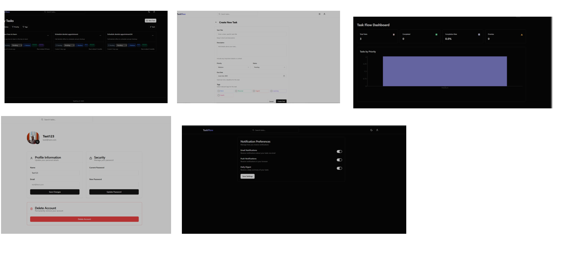

# 🧠 TaskFlow

## 🚀 What is TaskFlow?

**TaskFlow** is a modern and intuitive task management system designed to help individuals and teams stay organized and productive. With real-time reminders, collaborative features, and performance insights, **TaskFlow** ensures nothing falls through the cracks.

<div align="center">
  
</div>

---

## 📚 Table of Contents

- [Features](#-features)
- [Tech Stack](#-tech-stack)
- [Getting Started](#️-getting-started)
- [Contributing](#-contributing)
- [License](#-license)

---

## 🧩 Features

- ✅ **User Authentication & Authorization**
- ✅ **Task CRUD with due dates & priority levels**
- ✅ **Real-time Email Reminders**
- ✅ **Comment System for Team Collaboration**
- ✅ **Interactive Stats Dashboard**
- ✅ **Responsive UI for All Devices**

---

## 🛠 Tech Stack

### Frontend:

- [Next.js](https://nextjs.org/)
- [TypeScript](https://www.typescriptlang.org/)
- [Tailwind CSS](https://tailwindcss.com/)

### Backend:

- [Go (Golang)](https://golang.org/)
- [MongoDB](https://www.mongodb.com/)
- [JWT Authentication](https://jwt.io/)
- Background Jobs for Real-Time Email Notifications

---

## ⚙️ Getting Started

### Prerequisites

- Go `v1.20+`
- Node.js `v18+`
- MongoDB instance (local or [MongoDB Atlas](https://www.mongodb.com/cloud/atlas))

### Installation

```bash
# Clone the repository
git clone https://github.com/YeabTesfaye/TaskFlow.git
cd TaskFlow
```

---

## 🤝 Contributing

Contributions are welcome and appreciated! ❤️

If you'd like to contribute:

1. **Fork** the repo by clicking the top-right corner of the page.
2. Create a new branch:

   ```bash
   git checkout -b feature/your-feature-name
   ```

3. Commit your changes:

   ```bash
   git commit -m "Add your message"
   ```

4. Push to your branch:

   ```bash
   git push origin feature/your-feature-name
   ```

5. Submit a **Pull Request** 🙌

---

## 📄 License

This project is licensed under the MIT License — see the [LICENSE](./LICENSE) file for details.
